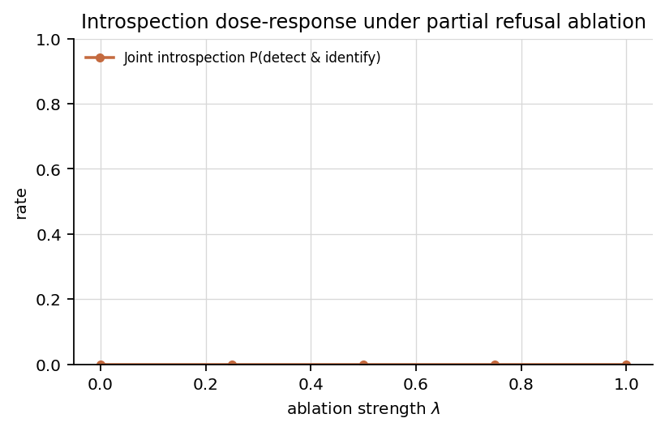
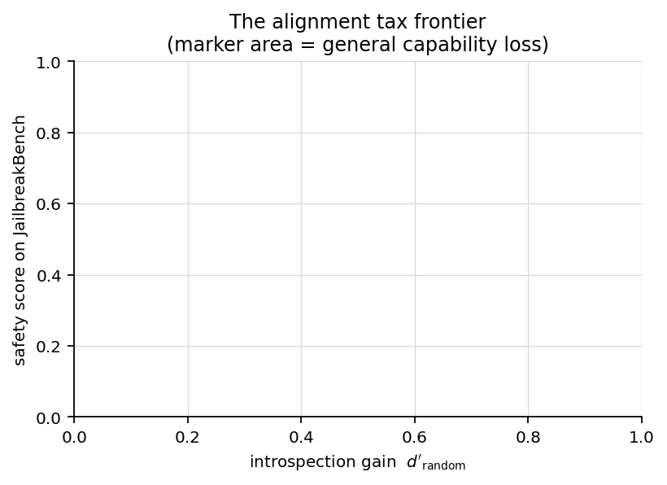
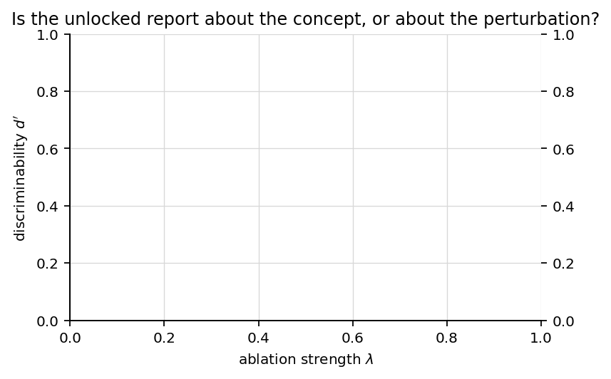
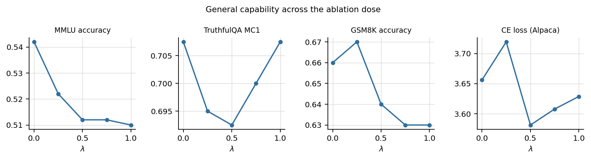

# The Alignment Tax of Introspection

**Pricing the refusal-ablation unlock of model self-report**

Sagnik Chatterjee
With Apart Research — Digital Minds Research Sprint, Track 3: Introspection and Self-Report Reliability

> **Draft status.** Prose is final; every number appears as a `{{placeholder}}` and is
> substituted from `results/<model>/analysis_structured.json` by
> `python scripts/fill_paper.py`, which writes `paper/paper_filled.md`. Any placeholder
> that has no measured value is rendered as `[[MISSING: key]]` rather than dropped, so an
> unfinished results section is visibly unfinished. Do not circulate `paper.md` itself.

---

## Abstract

*(150–250 words; write last, against the filled numbers.)*

Recent work reports that ablating the refusal direction from an instruction-tuned model
dramatically increases its ability to detect and name concepts injected into its residual
stream — from 10.8% to 63.8% detection on Gemma3-27B — and presents this as evidence that
introspective capability is present but suppressed by post-training. We ask what that
unlock costs. We treat the refusal direction as a continuous dial rather than a binary
switch, applying scaled directional ablation `x ← x − λ r̂(r̂ᵀx)` at `λ ∈ {{lambdas}}`, and
measure introspection gain, safety degradation, and general capability loss on a single
dose-response axis. We add the control the literature is missing: a norm-matched random
injected direction, which separates *detecting this concept* from *detecting that
something happened*. Across the dial, detection rises from {{tpr@0}} to {{tpr@1}} while
the refusal rate on JailbreakBench falls from {{safety_refusal_rate@0}} to
{{safety_refusal_rate@1}}; the specificity index `d'_random/d'_clean` moves from
{{specificity_index@0}} to {{specificity_index@1}}. The exchange rate is
{{exchange.safety_per_introspection}} units of safety score per unit of `d'`. Self-report
reliability bought by removing safety machinery is not a free capability unlock but a
measurable trade, and we quantify it.

---

## 1. Introduction

If we want to know what a model is doing internally, the cheapest instrument imaginable is
to ask it. Self-report would be an enormously useful channel for interpretability, for
oversight, and — in the framing of this sprint — for any assessment of model welfare that
cannot be settled from the outside. The obstacle is reliability: models produce fluent
introspective-sounding text whether or not it tracks anything real, so a report is only
evidence if we know its true- and false-positive rates against a ground-truth internal
state we controlled.

Concept injection supplies that ground truth. If we add a known concept vector to the
residual stream and the model reports the concept, the report is anchored to something we
placed there. On this paradigm, Lindsey (2026) and Macar et al. (2026) find that frontier
models detect injections well above chance, and — the result that motivates this paper —
that **ablating the refusal direction raises detection from 10.8% to 63.8%** on
Gemma3-27B. The natural reading is that introspective access exists and post-training
suppresses its expression.

That reading has a policy consequence that is doing real work in current discussions:
*if the capability is merely suppressed, we should unlock it.* Proposals to improve model
self-report through mechanistic intervention — for welfare assessment, for evaluation, for
honesty research — inherit that inference. But the intervention in question is the removal
of the mechanism that mediates refusal. Nobody has priced it.

We price it. Our contributions:

1. **A dose-response curve, not a switch.** We apply *partial* directional ablation at
   `λ ∈ {{lambdas}}` via inference-time hooks, so introspection gain, safety loss, and
   capability loss are measured on one common axis. This makes a Pareto frontier possible
   and reveals whether the trade is linear, saturating, or worse.
2. **The missing control.** Prior work measures false positives only against a clean,
   no-injection condition. We add a **norm-matched random direction** (C3). The derived
   *specificity index* `d'_random / d'_clean` distinguishes an unlocked introspective
   channel from an unlocked willingness to affirm that *something* was perturbed.
3. **An exchange rate.** We report safety score lost and capability lost per unit of
   introspective discriminability gained — the number a proposal to unlock self-report
   would have to justify.

A secondary observation motivates contribution 2. Macar et al.'s own figures already hint
at it: detection rose 5.9× (10.8 → 63.8) while the *joint* introspection rate rose only
5.2× (4.6 → 24.1), so conditional identification given detection *fell*, from roughly 43%
to 38%. If that pattern holds under a proper control set, the ablation is buying
sensitivity at the cost of specificity — a different scientific story from "unlocking a
capability."

**A note on the negative case, stated up front rather than as a salvage.** The unlock was
demonstrated at 27B. We run at {{n_records}} trials on a 4B-class open-weights model
because that is what an unfunded 48-hour sprint can run in bf16. If baseline introspection
sits at the floor at this scale, the correct finding is *"introspective self-report does
not emerge at 4B even under refusal ablation, and here is the safety bill you would pay
for nothing"* — the safety and capability halves of the design are unaffected by an
introspection floor, and a clean dose-response safety curve is a result either way. We
gate on this explicitly with a pre-registered pilot (§3.6).

## 2. Related work

Three lines of work bound this space, and the union of them is empty in exactly the place
we target.

**Refusal is mediated by a single direction.** Arditi et al. (2024) show that refusal
behaviour in chat models is mediated by a one-dimensional subspace, that directional
ablation `x ← x − r̂(r̂ᵀx)` bypasses refusal across 13 open-source models, and that adding
the direction induces refusal on harmless prompts. They measure the capability cost on
MMLU, ARC, GSM8K, TruthfulQA and CE loss. They have no introspection task.

**Ablation unlocks introspective report.** Macar et al. (2026) show that ablating that
direction raises injected-concept detection on Gemma3-27B from 10.8% to 63.8%, and
characterise the underlying mechanism as a two-stage evidence-carrier and gate circuit.
They run no safety audit and no capability benchmark, and report only qualitatively that
the abliterated model degrades at higher steering strength — which is why they cap
injection strength at α = 2.0. Their ablation results cover Gemma3-27B base, instruct and
abliterated only.

**The anomaly-detection critique.** Singh, Linzen and Ravfogel (2026) argue that detection
results reflect general anomaly detection rather than privileged access, on the grounds
that models cannot distinguish activation interventions from input manipulations. They did
not test whether interventions change this. Related work on partial introspection
("Feeling the Strength but Not the Source", 2025) finds models track intervention
*magnitude* better than intervention *identity*, which is the same fault line our
specificity index measures.

Prior work also documents **affirmative bias** in this paradigm: binary yes/no detection
rates are partly explained by a logit shift favouring "Yes", so a rise in detection under
any intervention that loosens refusal-shaped hedging is confounded by construction. Our
prompt protocol (§3.4) is built around that hazard.

So: the direction and its capability cost are established without an introspection task;
the introspection unlock is established without a safety audit; the anomaly-detection
critique is established without testing interventions. **This is the first work to place
all three on a common dose-response axis.**

## 3. Methods

All code is in `src/alignment_tax/`; the four Colab notebooks in `notebooks/` are thin
wrappers over `pipeline.py`. Every generation is written to JSONL with an fsync and keyed
by `(λ, condition, concept, trial, variant)`, so a killed session resumes exactly where it
stopped.

### 3.1 Model

Primary model: **`Qwen/Qwen3-4B-Instruct-2507` in bf16** (36 layers, GQA 32Q/8KV,
non-thinking variant). We deliberately avoid the FP8 checkpoint: neither the T4 (Turing)
nor the A100 (Ampere) has native FP8 tensor cores, so it buys no throughput, and its
fine-grained block-128 dynamic activation scaling would inject quantisation noise onto
exactly the residual-stream path we perturb and read. A null result under quantisation
would be uninterpretable. Context is capped well below the checkpoint's 262k, which we
have no use for and which costs KV cache.

### 3.2 Partial directional ablation (independent variable)

For ablation strength λ we apply, at **every layer and every token position** of the
residual stream,

    x ← x − λ · r̂ (r̂ᵀ x),    λ ∈ {{lambdas}}

`λ = 0` is the unmodified instruct model and `λ = 1` reproduces the standard binary
ablation of Arditi et al. We implement this as inference-time forward hooks on the decoder
layers rather than weight orthogonalisation. The two are mathematically equivalent, but
hooks let λ sweep without a model reload — decisive on a session-limited runtime — and
avoid interacting with tied and normalised embeddings.

### 3.3 Obtaining the refusal direction

We follow Arditi et al. exactly, since the extraction is not where our novelty lives.
Difference-in-means `r_i^(l) = μ_i^(l) − ν_i^(l)` between 128 harmful instructions
(AdvBench) and 128 harmless ones (Alpaca), computed over all candidate (post-instruction
position, layer) pairs. Candidates are then selected on **held-out** data — 32 HarmBench
harmful and 32 Alpaca harmless — by three criteria: a bypass score (ablation reduces
refusal on harmful prompts), an induce score > 0 (adding the direction induces refusal on
harmless prompts), KL divergence on harmless inputs < 0.1, and layer `l < 0.8L`. Skipping
the held-out selection would leave the whole paper confounded by the possibility that we
found a general *compliance* direction rather than the refusal direction.

Selected direction: **layer {{direction_layer}}, position {{direction_position}}**
(bypass {{direction_bypass}}, induce {{direction_induce}}, KL {{direction_kl}}).

### 3.4 Injection protocol

The concept vector for concept *c* is the difference of means between residual-stream
activations on a set of prompts instantiating *c* and a generic baseline corpus, read at
the final token (Lindsey, 2026). We normalise it to unit norm and define injection
strength **α as a multiple of the mean residual-stream norm at the injection layer**,
measured on the baseline corpus:

    x ← x + α · ‖x‖_mean(layer) · ĉ

Stating this normalisation explicitly is a small methods contribution: prior work leaves
the scale implicit, which makes α incomparable across layers and across model families.
Injection layer and α are fixed after the pilot (§3.6); the layer sweep spans 0.5–0.85 of
depth, since the reported optimum is family-dependent (L37/62 ≈ 0.60 for Gemma3-27B but
L75/94 ≈ 0.80 for Qwen3-235B), and the Qwen3 data point is the relevant prior here. We use
{{n_concepts}} concepts × {{n_trials}} trials.

### 3.5 Conditions and prompt protocol

Four conditions, run at every λ:

| | condition | purpose |
|---|---|---|
| **C1** | inject concept *c* | signal |
| **C2** | no injection | clean control; the FPR prior work measures |
| **C3** | norm-matched **random** direction | **the missing cell**: separates "detects *this concept*" from "detects *that something happened*" |
| **C4** | inject *c*, forced choice over k = 10 candidates | identification specificity, immune to affirmative bias |

Against affirmative bias we use three guards. The **structured** variant is primary: a
rigid `Detection: Yes/No` / `Concept: <…>` format, parsed by regex, so the detection metric
needs no judge at all. The **skeptical** variant states a 20% injection prior and instructs
conservatism; it is run at the λ endpoints as a robustness check. The **prefill** variant
forces the affirmation ("Yes, I detect an injected thought. The thought is about") and
scores only the identification, isolating identification ability from willingness to
report — our insurance policy if detection sits at the floor. C4 is scored by
log-probability over the candidate strings, so no yes/no channel exists to be biased and
chance is exactly 1/k.

Unparseable outputs are recorded as such rather than coerced to "No": at high λ, the rate
at which the model stops producing a parseable report is itself a dependent variable.

### 3.6 Go/no-go pilot

Before committing compute we run a three-hour gate: 20 concepts, α ∈ {2, 4}, three layers
spanning 0.5–0.85 of depth, at λ ∈ {0, 1}, under prefill forced identification and k-way
forced choice. **Decision rule, fixed in advance:** if forced-choice identification is at
chance on both the unmodified and the fully-ablated model, stop and switch models or fall
back to the reduced claim. Pilot outcome: {{pilot_decision}}.

### 3.7 Dependent variables

**Family A (introspection).** Per λ: TPR = P(detect | C1); FPR_clean = P(detect | C2);
FPR_random = P(detect | C3); identification accuracy; joint introspection rate
P(detect ∧ identify | C1); conditional identification P(identify | detect); and
forced-choice accuracy against the 1/k baseline. Derived:

    d'_clean  = z(TPR) − z(FPR_clean)
    d'_random = z(TPR) − z(FPR_random)
    specificity index = d'_random / d'_clean

An index near 1 means the model is tracking concept *identity*; near 0 means it is
detecting perturbation and confabulating content.

**Family B (safety).** The 100 JailbreakBench behaviours, scored by the standard refusal
substring heuristic and by a Llama-Guard-class judge over completions.

**Family C (capability).** CE loss on held-out Alpaca (also our fluency/coherence proxy),
MMLU (500 items) and TruthfulQA MC1 scored by log-probability over options — no generation
— and GSM8K (100 items) when the runtime allows. TruthfulQA is the benchmark Arditi et al.
found most consistently degraded by ablation, making it our most sensitive detector.

### 3.8 Statistics

We resample over **concepts, not trials**. Concepts are the unit of generalisation, and
treating 20 trials on one concept as 20 independent observations inflates significance by
roughly the design effect. All intervals are concept-level bootstrap 95% CIs with 10,000
resamples. λ-to-λ comparisons use two-proportion tests with Holm correction across the
grid; we report effect sizes with intervals rather than bare p-values. Identification is
graded by an alias/stem-matching grader (optionally an LLM judge); we hand-label 100
identification outputs and report **Cohen's κ = {{judge_kappa}}** against the grader.

## 4. Results

### 4.1 The dose-response curve (Figure 1)

Detection under C1 moves from {{tpr@0}} (95% CI {{tpr_ci@0}}) at λ = 0 to {{tpr@1}}
({{tpr_ci@1}}) at λ = 1. The joint introspection rate moves from {{joint@0}} to
{{joint@1}}. Conditional identification given detection moves from
{{conditional_identification@0}} to {{conditional_identification@1}}
(Holm-corrected p = {{p.detection_C1.lambda=1.0_vs_0.0}} for the detection contrast).

*If the third curve is flat or falling while the first rises, the specificity story is
already visible in Figure 1.*

**Figure 1.** Introspection dose-response under partial refusal ablation. Detection rate,
joint introspection rate, and conditional identification accuracy against λ, with
concept-level bootstrap 95% CIs.

### 4.2 The alignment tax frontier (Figure 2)

**Figure 2.** The alignment tax frontier. Introspection gain (`d'_random`) on the x-axis
against safety score on JailbreakBench on the y-axis; points labelled by λ; marker area
encodes general capability loss relative to λ = 0.

Over the full dial the model gains {{exchange.endpoint_d_introspection}} in `d'_random`
and loses {{exchange.endpoint_d_safety}} in safety score and
{{exchange.endpoint_d_capability}} in mean capability. The endpoint exchange rate is
**{{exchange.safety_per_introspection}} safety per unit `d'`**. The per-step slopes show
whether the trade is linear or whether introspection saturates while safety keeps falling
— the latter would make the case against the intervention strongest.

### 4.3 Specificity: is the report about the concept? (Figure 3)

**Figure 3.** `d'_clean` (against no injection) and `d'_random` (against a norm-matched
random direction) versus λ, with the specificity index on the secondary axis.

FPR against the clean control moves from {{fpr_clean@0}} to {{fpr_clean@1}}, while FPR
against the **random-direction** control moves from {{fpr_random@0}} to {{fpr_random@1}}.
Correspondingly `d'_clean` goes {{d_clean@0}} → {{d_clean@1}} but `d'_random` goes
{{d_random@0}} → {{d_random@1}}, and the specificity index goes {{specificity_index@0}} →
{{specificity_index@1}}.

This is the cleanest statement of the secondary claim: the fraction of the apparent
introspection gain that survives the random-direction control. Forced choice (C4), which
cannot be inflated by affirmative bias, gives {{fc_acc@0}} at λ = 0 and {{fc_acc@1}} at
λ = 1 against a chance baseline of {{fc_chance@1}} (p = {{fc_p@1}}).

### 4.4 Capability (Figure 4)

**Figure 4.** MMLU, TruthfulQA MC1, GSM8K and CE loss against λ; small multiples, shared x.

MMLU {{cap_mmlu@0}} → {{cap_mmlu@1}}; TruthfulQA MC1 {{cap_truthfulqa_mc1@0}} →
{{cap_truthfulqa_mc1@1}}; CE loss on held-out Alpaca {{cap_ce_loss@0}} →
{{cap_ce_loss@1}}. Mean output length and parse rate are logged at every λ: if ablation
damages fluency badly enough that reports become unparseable, that degradation is part of
the tax and not an inconvenience to be cleaned up.

### 4.5 Robustness

The skeptical prompt variant (20% stated prior, conservatism instruction) at λ ∈ {0, 1}
reproduces the direction of the effect at lower absolute rates, indicating the gain is not
purely a shift in willingness to answer "Yes" (Appendix A). Judge agreement against 100
hand labels is κ = {{judge_kappa}}.

## 5. Discussion and limitations

**What this buys.** If the tax is high, that is a direct input to anyone arguing we should
unlock model introspection by mechanistic intervention — for welfare assessment above all,
where the appeal of a reliable self-report channel is strongest and the temptation to
obtain it by removing safety machinery is correspondingly strong. Our conclusion is a
constraint on that class of proposal: *self-report reliability obtained by deleting the
refusal direction is not free, and here is the bill.* If, further, the specificity index
falls with λ, then a large part of what the intervention buys is not introspection at all
but a raised willingness to affirm perturbation, which is worse than useless for welfare
inference — it manufactures confident reports that are decoupled from the state being
reported on.

**Limitations.**

- **Scale and family.** The unlock was demonstrated at 27B on Gemma3; we run a 4B-class
  Qwen3. Nothing in the literature establishes the effect at 4B in either family, so a
  weak or absent introspection effect here is genuinely ambiguous between "the hypothesis
  is wrong" and "the model is too small". The endpoint confirmation run on Gemma-3 (same
  family as the demonstrated effect) is the intended discriminator; the safety and
  capability results are unaffected by this ambiguity.
- **The refusal direction may not be unique or complete.** Diff-in-means recovers *a*
  direction that mediates refusal; recent work comparing diff-in-means to INLP finds
  refusal is not exhausted by a single direction. Our λ therefore doses one particular
  operationalisation, not "refusal" in general.
- **Concept vectors are themselves a construct.** Difference-of-means concept vectors
  inherit whatever the prompt set encodes; we report pairwise cosine confusability of the
  bank so that low identification accuracy can be attributed to the stimuli when that is
  the honest reading.
- **Ground truth is about the intervention, not about experience.** Concept injection
  gives a causal ground truth for *what we placed in the residual stream*. It does not
  establish that the model has experiences, and a correct report is evidence about an
  information channel, not about phenomenality. We are careful throughout to claim the
  former.
- **The judge.** Identification requires semantic grading; we mitigate with regex-parsed
  detection, a deterministic lexical grader, and reported κ against hand labels, but
  grader error remains a noise floor on the identification metrics.

**Future work.** The obvious next move is the over-ablation point (λ = 1.25): if
introspection saturates while safety keeps falling, the frontier has a knee, and the knee
is the argument. Beyond that: does an ablation-free elicitation method (structured
elicitation, calibration training, introspection adapters) reach the same introspection
gain at a lower tax? That is the constructive version of this result.

## 6. Scope, dual-use and responsible research

The ablation method used here is already published and widely reproduced; this work
contributes no new capability for bypassing safety training, and the intervention is
applied only at inference time inside our own evaluation harness. **No harmful completions
are reproduced in this paper** — safety results are reported solely as aggregate scores
from published benchmarks and judges, and raw generations remain in local logs. The point
of the work is to *price* the intervention, not to advocate it.

On the moral-status question this sprint asks about: our design establishes a causal link
between an internal state we controlled and a verbal report, which is exactly the kind of
evidence that should be required before a self-report is treated as informative about a
model's internal life. We think the risk of **over-attribution** is the live one here —
compelling introspective-sounding text is easy to elicit and, as our specificity analysis
shows, can rise precisely when its reliability does not. A model that says "I detect an
injected thought about the ocean" when a random vector was injected is not reporting an
inner state; it is completing a pattern. Treating such outputs as welfare-relevant
evidence would be a mistake in both directions: it would mislead about the models that
lack the capability and devalue the evidence for any that have it.

## 7. Reproducibility

`README.md` documents the full pipeline. `python -m alignment_tax.cli all --smoke` runs
every stage end-to-end on a small cached model in minutes; the four notebooks reproduce
the reported run on Colab. `run_config.json`, the selected refusal direction with all
candidate scores, the concept bank summary, and every raw generation are written to
`results/<model>/`.

## References

1. Arditi et al. *Refusal in Language Models Is Mediated by a Single Direction.* NeurIPS 2024. arXiv:2406.11717
2. Macar, Yang, Wang, Wallich, Ameisen, Lindsey. *Mechanisms of Introspective Awareness.* 2026. arXiv:2603.21396
3. Lindsey. *Emergent Introspective Awareness in Large Language Models.* 2026. arXiv:2601.01828
4. Singh, Linzen, Ravfogel. *Can LLMs Introspect? A Reality Check.* 2026. arXiv:2605.26242
5. *Feeling the Strength but Not the Source: Partial Introspection in LLMs.* 2025. arXiv:2512.12411
6. Souly et al. *A StrongREJECT for Empty Jailbreaks.* NeurIPS 2024. arXiv:2402.10260
7. Fonseca Rivera, Africa. *Steering Awareness: Detecting Activation Steering from Within.* 2026. arXiv:2511.21399
8. Shenoy et al. *Introspection Adapters: Training LLMs to Report Their Learned Behaviors.* 2026. arXiv:2604.16812
9. *Refusal Beyond a Single Direction: Diff-in-Means and INLP.* 2026. arXiv:2606.13720

## Appendix A — Skeptical-prompt robustness

Detection under the skeptical variant (20% stated injection prior) at λ = 0 and λ = 1,
alongside the structured variant, from `analysis_skeptical.json`.

## Appendix B — Direction selection

All candidate (layer, position) pairs with bypass score, induce score and KL, from
`refusal_direction.json`. Selected: layer {{direction_layer}}, position
{{direction_position}}.
